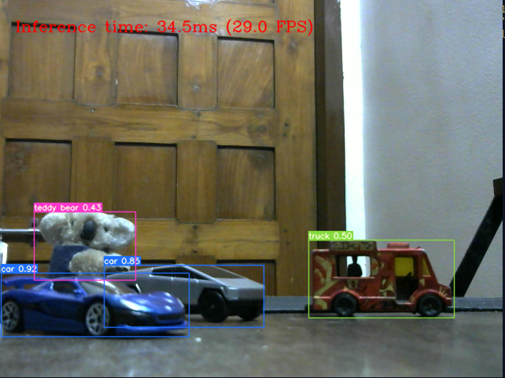
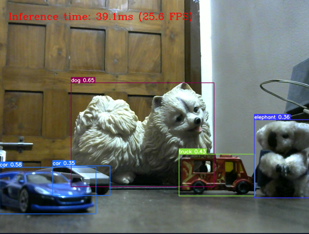
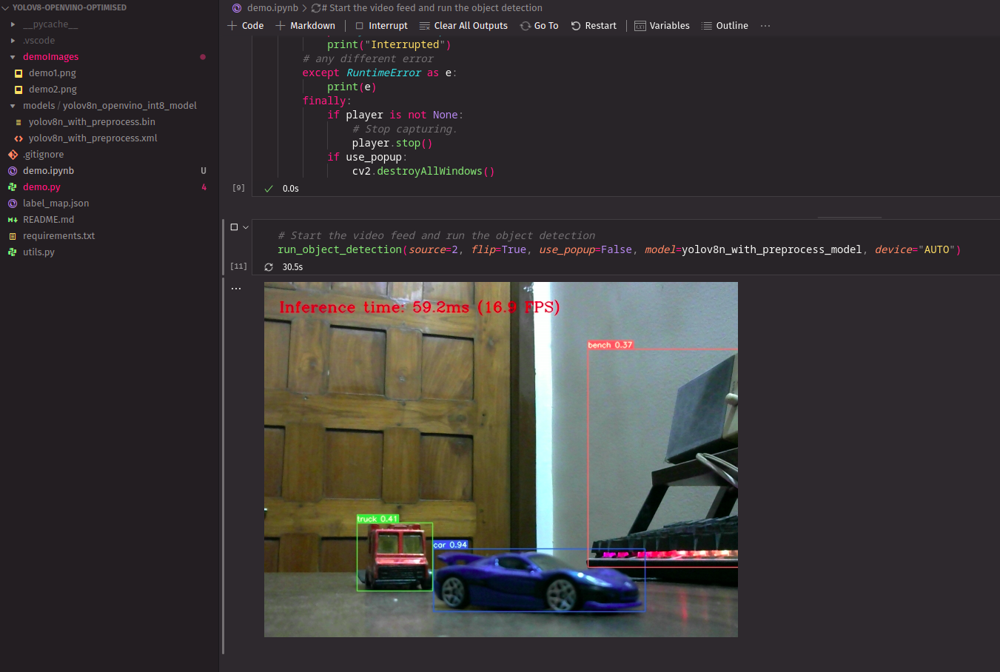
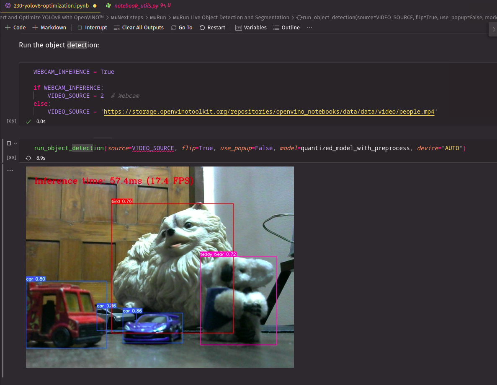

# YOLOv8 OpenVINO Optimized Demo
This is a demo of YOLOv8 object detection model optimized with OpenVINO Toolkit. (uses simple COCO dataset)

## How to run
1. Install the requirements:
    ```bash
    pip install -r requirements.txt
    ```
2. Run the demo:
    ```bash
    python demo.py
    ```
    You can also run the notebook version of the demo by running cells in `demo.ipynb` file.

## Demo




